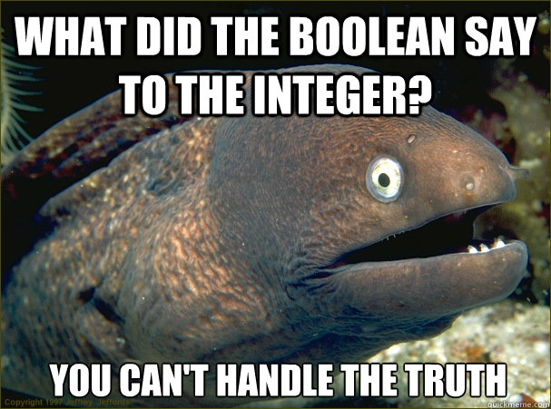
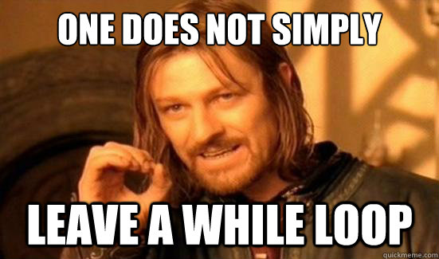

# Chapter 1: Python Basics
Python itself is a programming language. When you run python, you first will have trouble finding out what is going on. The more programs you write and the more you engage in programming, the easier it will get.
When you run "python", the so-called IDLE (Integrated Development Environment) opens.
There are two different ways to write Python code: By writing single-line commands in the *interpreter* or via running whole scripts.
For very simple programs, it is enough to use the Python interpreter. See the three `>>>`? This is where we will start to write programs.

## Hello, world! or getting started with Python
Traditionally, in programming, the first thing to do when learning a new programming language is `Hello, world!`. In Python, this is very simple (you do not have to copy `>>>`, that is just to indicate that it is written in the Python interpreter). Just type
```python
>>> print("Hello, world!")
```
... and that is it! In order to run your program, hit `Enter`. Already, for this simple program to work, a lot of things are going on. `print()` does a very simple thing. It just tries to display the contents inside the parentheses. More about this in later exercises.

**Try it out!**

Congratulations on your (potentially) first program ever written! If you want to, try changing the text inside the `print` statement. What happens if you do `print(Hello, world!)` i.e. leaving out the quotation marks?

## Variables and statements
Now, finally that we have an idea on how to use `print()`, we can advance to nicer programs. A very important aspect of programming are something called **variables**. Just like in Mathematics, we can assign values to things. Try it out, write the following statements, one by one:
```python
>>> x = 5
>>> y = 3
>>> print(x+y)
8
```
As you probably expected, this will print out `8`. No surprise so far.
Interestingly, we can overwrite variables: Type out
```python
>>> x = 5
>>> superBigNumber = 3133723666
>>> x = 7 + x
>>> print(x + superBigNumber)         
3133723678
```
Who said variable names had to be boring?
***
Despite all humour, variable names should be useful. For example if your program is storing your height, you might actually call it `height`. People sometimes use useless names for their variables - do not be like these people. Sooner or later, as programs get more complex (commercial applications often have 100 000s lines of code!) good naming gets important, so you might just stick to it for now already.
***
In this example, multiple things are happening at once. First of all, in Mathematics, something like `x = y + x` does not make much sense: The two statements at each side have different values. However, in Computer Science, things are not necessarily how they are in Mathematics. Actually, when Python tries to understand what you have written, it first tries to find out the value on the *right side of the equation* before assigning the value to the left side.

If you are studying computer science, you don't have much time. So, because of that (actually mainly because it is more readable), there is an abbreviation when you want to do things like `x = x + 3` or `x = x * x`, i.e. adding variables to itself - like in the example above. These statements can be abbreviated to:
```python
>>> x = 5
>>> x += 3
print x
8
>>> y = 13
>>> y *= x #the same as y = y * x
104
```

There you go! Now, you saw the `#` after our line of code? This is a so-called *comment*. Comments are useful when you want to write something about the code. The Python interpreter will find the `#` and from that point onwards, it will just ignore everything entered in this line.

Speaking of the difference to Mathematics, there is another one. Try out multiplication:
```python
>>> print(4 * 5)
20
```
This works fine. But what about division?
```python
>>> print(4 / 5)
0
```
Huh. What happened here? Well. Normal division in Python simply slices off what would be after the dot in a division. This is because Python variables have something called *type*. We say a **variable is of a certain type**.

##Python types
We have already seen whole numbers, i.e. 5, 3, 9, 14275855431 or -3014. These numbers are of type **integer** (or *int*). Similarly, Python has numbers with positions after the dot, so-called **floating-point numbers** (computer scientists call them *float*). The good thing about division with floats is that Python is able to do division with positions after the dot. Already, we see that Python tries to understand the statements that we write and interpret them in the most intelligent way it can: If a variable is of type **integer**, division stops before the dot, otherwise,the result is no integer any more! Similarly with floats: Division with floats will always (actually, only in most cases) ending in floats.
```python
>>> print(4.0 / 5)
0.8
>>> print(8.5/0.25)
34.0
```

***
For more complex formulas, in Mathematics, you have learned that we use parentheses to show what to compute first. Computer Science is very much related to Maths and the same convention applies. Take the following example. What will be the output (see end of this part for solution)?
```python
>>> print((5 + 3)/4) #(a)
>>> print(5 + 3 / 4) #(b)
>>> print(5 + (3 / 4)) #(c)
```
***

There is one more thing with types: When trying to use different types together, we get into a whole different world. One of the other types are so-called **strings**. Strings are defined as a series of characters - sounds too complicated, why not just say a series of letters/words, you say? Well, you see, while we as humans usually have pretty normal sentences like "Buy a house", something like "asdklfnea;sefkanfei383912rn12n52112,5.,125,21.}" is also a valid string, although it may not necessarily be what we as humans typically use every day.

Strings are awesome! Try the following:
```python
>>> myName = "Peter"
>>> myFriendsName = "Paul"
>>> print(myName + " is friends with " + myFriendsName)
```
What happens? Well, the result `Peter is friends with Paul` gets printed. As you can see, we can use the `+` operator for "adding" strings to one another. When Python computes the values in the `print()` statement, it actually first combines the individual elements.

We call this procedure of adding things to the end of other things **appending** i.e. " is friends with " gets appended to `myName` (If you want to get specifically into the details of programming languages, in the specific case of strings, the process of appending is called *concatenation*, but don't worry about that for now, it is not important).

However, when we try to do the following:
```python
>>> myName = "Peter"
>>> myAge = 876
>>> print(myName + " is " + myAge + " years old")
```
we get an error! That is due to the fact that the `+` does not know what to do in this case: Should it treat the value stored in " is " as a number and literally add it to the integer myAge, or should it treat myAge as a String and append it to " is "? In this case, we have to *tell the operator what to do*. When we want to use numbers (integers, floats) as strings, we put backticks (\`\`) around numbers to convert them to Strings. This procedure of taking a value of one type and changing it to another type is called `type conversion`. The correct way to do the example above would be:
```python
>>> myName = "Peter"
>>> myAge = 876
>>> print(myName + " is " + `myAge` + " years old")
```
Try it out for yourself!

One more thing: In Python (and also in may other programming languages), there is another data type for individual characters, simply called **characters** (or **chars**). There is a special syntax for chars: Because they are so similar to Strings, we also show them with quotes, but because of their difference, we use single quotes.
```python
>>> someChar = ':'
>>> someOtherChar= 'D'
>>> print(someChar + someOtherChar)
:D
```

The good thing is, because chars are so similar to strings, there is not much type conversion to be done, we just append one variable to another. Even `'d' + "iesel"` (character + string) would work fine.

To summarize:

The `print()` function prints results on screen.
Variables have a *type* such as integer, float or String (in fact, there are many more - even only for numbers), a *name* and hold a *value*.

Solution for the question on parentheses:
(a) 2 (b) 5 (c) 5

##Simple Python Scripts and input
So far, we have used the python interpreter to print things on-screen. However, if we want to create more complex programs (games!!!) then we have to turn to scripts. To create a new Python script, simply click on `File -> New Window`. A new empty window should open. In this window, you can type commands, just like in the interpreter. When Python goes through your commands, it does so by starting at the top and working its way through each line until it reaches the end of the file. So, to familiarize yourself with the new environment, just try out what we did before. The last program would look something like this:
```python
someChar = ':'
someOtherChar= 'D'
print(someChar + someOtherChar)
```
Really the same, isn't it? When you want to run your program, go to `Run -> Run Module` or press `F5` on your keyboard.

By the way: Do not be intimidated by the colors in the program. They are just there to support readability of the code you have written and do not add any additional information.

Let's cover two more data types, shall we?

The first one is easy: **None**. None is simple. If something has nothing, then it is of type none. No seriously. We typically use `None` when we want to refer to variables that have no value. E.g. say you went out with your buddy to buy ice cream, but only your friend bought some. Then we might have:
```python
...
friendIceFlavour = "Strawberry"
myIceFlavour = None # :(
...
```
Sad, but true. You might say something like this is useless but in fact, we often need to check if something is None (note that we always use a capital N!). More on this later.

One last data type: **Boolean** (why this weird name? Because George Boole invented this concept!). Boolean is also easy: A value of type Boolean can be either true or false, nothing more. In Python, this looks something like this:
```python
iAmCool = True
youAreCool = False
```


As integers hold - well - integers and booleans true or false, integers literally cannot handle the truth. HAH!

Please note here that `True` and `False` are also written in capital letters. If you type in these boolean values with lowercase letters, you  get an error. This is because in most programming languages, there are *reserved words*. `None`, `True`, `False`, are all reserved words that have a specific meaning, which means that you cannot create variables with such names.
Later more about booleans (or *bools*, in computer science speak). For now, just remember their existence.
##Exercises on variables and type
For these exercises, we desperately need two more functions: `int()` and `input()`. `int()` tries to convert a value to an integer (who would have guessed?) and `input()` prompts the user to input something.

A simple program using these two functions which adds two numbers and prints the result:
```python
firstInput = input() #the output from input() goes to int() which takes exactly one value
firstInt = int(firstInput) #convert to integer
secondInput = input()
secondInt = int(secondInput)
print(firstInt + secondInt)
```
Ok, now we can do some exercises. For now, these are not yet games, but do not turn away just yet: As we teach you more, you will be better programmers and able to do more!
1. Make a program that displays the following, storing the values of 5 and 58337 internally and then storing the sum, the product and the division in a different variable. After that, print the result to the screen using the newly-learned technique of appending strings:

`The sum of 5 and 58337 is 58342, their product is 291685, and 58337/2 is 29168.5 `

2. Write a program that asks for your friends name (or your name, if you prefer) using `input()` and displays it on screen, together with a message (`print()`). Something like this:
```
Please enter your friend's name!
Bob
Hello, Bob! I hope you are feeling good today.
```
3. While some calculations are fine, for bigger numbers, letting a computer do the work is much better (in fact, number crunching is very common in game design, when drawing complex shapes!). Write a program that takes two numbers (via `input()`) and adds them together!
4. Write a program that takes one number and prints the square of the number.
5. What is the end value of `x`?
```python
x = 5
y = 5.0 - 3
x /= y
z = x * y
x = x /3 + 3 / 2 * z
```
... and that's it. You made it through the first part, congratulations! Next up: Conditional statements (for which we definitely need bools and input, so keep these in your head!)


*Solution for the teacher*
```python
x = 5 # x = 5
y = 5.0 - 3 # 2.0
x /= y # x = 2.5
z = x * y # z = 5.0
x = x /3 + 3 / 2 * z # x = 35 / 6 = 5.8333333333
print x # will print 5.833333333335
```
(5.83333333333333333 -> 35/6 Computers can only store a finite number of decimal spaces. That is the reason why with bigger numbers, floats can often get inaccurate -  they have only a limited amount of space.)
## Conditional statements
##Exercises for Conditionals
quiz game

## Loops
As we have seen in the previous section, conditionals are very important in something called *control flow*, the idea of changing what the program does, depending on what we want it to do. Sounds simple? Well, it is.

Similar to conditionals, we can use so-called *loops* to make the computer do more useful things. In Python, we have two basic types of loops. These loops work in the following way: Before each time the code "in" the loop is executed (a so-called iteration), we check if a certain boolean condition is fulfilled (like with conditionals). If it is, then the body of the loop gets executed once more.

### For loops
If we want to repeat a specific action in our programme, we can write it over and over - for example, if we would like to create a new variable, and add 1 three times so that its value is 3:

```python
i = 0
i += 1
i += 1
i += 1
```

Imagine doing the operation not 3 times, but 10000 times, then the code would look ugly as hell! That is why we have for loops, which look like this:

```python
for variable in xrange(begin, end, step):
  statements
other code
```

Even though it might look scary at first, in reality it is really simple - if we want to rewrite the code from above, it would look followingly:

```python
i = 0
for step in xrange(3):
    i += 1
```

and after the code has finished its execution, `i` would have value of 3!

Let's analyze the first example though: `for` keyword tells Python that we are going to repeat certain action over and over, `xrange()` is the function which specifies how many times and `step` is the name of the loop variable - if we are interested in knowing how many repetitions we have done, we can print the value of step (sort of).

If you notice, I said that `xrange(...)` takes three arguments, `begin`, `end` and `step` - the last one is voluntary, others are mandatory. Thus if I write a loop like this one:

```python
for number in xrange(1, 11, 2):
    print number
```

We will see that the output will be:
```python
1
3
5
7
9
```

As you might have noticed, the number 11 has been excluded! That is because `xrange(...)` excludes the last number from the range - in reality the loop runs only from 1 to 10 and within this range we have only numbers 1, 3, 5, 7, 9 which are odd.

### While loops
The best way to find out what while-loops do is to see a live example. Just copy the code and see it for yourself:
```python
i = 1
sum = 0
while i < 5:
  print i
  i += 1
  sum += i
print sum
```

Generally, while loops follow the following structure:
```python
while *expression*:
  statements
other code
```

Important note that the spaces at the beginning of the line show that the code after that belongs to the loop. In other programming languages, you might have different ways to express that you are inside a loop. In Python, however, this is very simple: Just make sure that you have *spaces at the beginning of the line* and that the number of spaces inside the same loop works.

That said, let's analyze what we have written in the first example: The `while` keyword says to python: Alright, the thing after this is a boolean expression. In this case, this is `i < 5`. At the start, `i = 1`. Even if you are not good at Maths, you may find that `1 < 5`, so the boolean expression is `true`, meaning the code after that gets executed. The colon at the end (similarly to conditionals) is just a feature of Python to indicate the end of the statement (think of it as writing headlines).

Now, each time the loop gets executed, the variables `i` and `sum` get updated. Ok. So far so good. Let's look at some special cases (try the examples out for yourself):

```python
i = 13
while False:
  i /= 2
print i
```
This loop never gets executed! Since the statement is `False`, the expression is false and never gets executed.
```python

while True:
  str += 'a'
print str
```



Well, with this loop, all I can say is...

You see, when you try running the program, obviously it will never end - because of that - never execute `print str`.

-----------
Now! You might say "oh loops so easy!" (and in fact they are but psssh). It can get quite complicated when we have more complex things inside the loop. By combining boolean expressions, it can get quite complicated (If you are keen on learning more, check out https://en.wikipedia.org/wiki/De_Morgan's_laws)

----------------------------------------------------

####Exercises
1) Write a program that writes out all of the numbers between two numbers specified by the user. Use the `input()` and the `int()` function to get values. A dialogue should look something like this:
``` python
Please enter the lower boundary:
5
Please enter the upper boundary:
7
Values:
5
6
7
```
For this program, note that the loop might not necessarily be executed if the lower boundary is bigger than the upper boundary.

*Challenge*: Use another while-loop to check if the lower boundary is indeed lower than the upper boundary. If it isn't, just display the input dialogue again.

2) Write the `guessing game`! @TODO
3) Write a program asking people for a number. Then, display all factors of said number
```
1) Check if the number is equal to one (or smaller). If not, then continue the loop.
2) You can calculate the remainder of a division with the % operator.
E.g. 5 % 3 = 2 (since 5 = 1 * 3 + 2)
If the remainder is zero, then the current number is a factor. Print it!
3) In any case, decrease the number by one and check again.

```
An example interaction would be:
```python
Please enter your nice number:
24
24 has the following factors:
24
12
8
6
4
3
2
1
```
###For loops
problem: For loops require knowledge about iterators -> lists -> maybe after arrays?

##Exercises for loops
guessing game


## Arrays and Whack-A-Mole
There are many more data types in Python. One very widely used data type are lists.
Lists are nothing more than a collection of items, to which you can add elements, remove some or access particular elements. In Python (in fact in many programming languages), lists are simply created by the following command:
```python
crocodile = 'b'
things = [5, 1.7, crocodile]
print(things[0])
5
```
See the square brackets? They indicate start and end of a list. You separate values in the list by commas. Also note that we access values in a list with square brackets and the index of the value.
Here's the deal though. So far, you have counted from 1 (one, two, three... ok you know how numbers work). Guess what? Your life was a lie so far, computer scientists typically count from zero. This is why....
