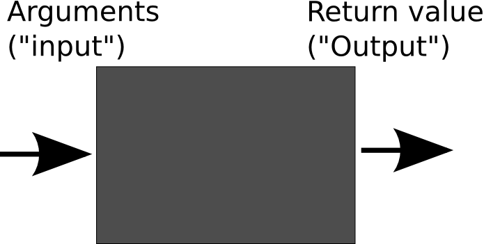

# Chapter 2: Advanced Python

## Functions
### Writing better structured code

Previously, if we wanted to carry out actions twice or (even!) three times in a row, we would loops to do that. Similarly, we used if-statements to to select which parts of the code to execute in what cases.
However, we might want to reuse some functionality in different parts of the code, or provide similar sections of code. In Mathematics, you should have come across functions. In programming languages (and, because of that also in Python), we have functions as well. Instead of consisting of terms like a + b - c, we can just include **code** in functions. However, the basic principle is the same. Here's a little diagram to help you.



### What is a function?
A function is a black box in which something happens. For example, if we want to calculate a double of a number, we can write it as:

```
f(x) = x * 2
```
Here, `f` is our *function name*, `x` our argument (input), and we return `x * 2`, i.e. double the value of the input.

In Python, we create functions by using the `def` keyword. Here is the above example in Python code:
```python
def getDouble(number):
  return number * 2
```

Functions have the following properties:

  * They take a number of **arguments** specified by parentheses (in the example, `x` is an argument)
  * They may **return** a value (but don't have to). The return type is typically the result of a series of different commands
  * They sum up a **contained unit of code** that sums up a process

```python
def function_name(argument1, argument2, ...):
  do_something()
  
  return
```

###Example
To put these aspects more into perspective, here is one more example program:

'''
This program provides a simple menu to find out, if a name is in a list.
Also: These single quotes show comments over multiple lines, if you want to display more stuff. For example when explaining what your program does (which you should do!)
'''

```python
names = ["Peter", "Paul", "Mary", "George", "Janos", "Chris", "Jaro"]

def isNameThere(name):
  for n in names:
    if n == name:
      return True
  return False

def getAction():
  print("1: See if name is in list")
  print("2: Quit")
  return int(input())

def decide(choice):
  if choice == 1:
    displayFind()
    decide(getAction())
  elif choice == 2:
    displayQuit()
  else:
    displayError()
    decide(getAction())

def displayFind():
  print("Please enter a string to see if it is in our list.")
  n = raw_input() # raw_input always interprets input as strings
  if isNameThere(n):
    print("It is indeed in our list!")
  else:
    print "Sorry, not known to me."

def displayError():
  print("Sorry, did not quite get that.")

def displayQuit():
  print("Goodbye!")

decide(getAction()) # actual program that we execute
```

A couple of things here:
1. Notice how the functions each show a single thought? This is crucial. Even if you only call your function a few times (or even once), it makes sense to keep functions **VERY** short (and by that we mean six lines or less, if possible). Oftentimes, what programmers do, they end up writing code and writing code and suddenly, they have a huge program with lots of duplicate code. On another note: Once they see their code later, they won't remember what they wrote because the code is so messy and complicated. In Computer Science slang, this is called *spaghetti code* or we say code has a *smell*.
2. There are a couple of things in the above code that don't quite make sense. Can you spot these? How might you design a better program? Note: Here, it's not about who is right or wrong, but it is more about discussing what good code is about. So no final solution is provided.

### Notes on good code style
In order to make our code readable and easily understandable by others as well, we need to adopt and adhere to a certain coding style. The coding conventions for Python are in a document called [PEP8](https://www.python.org/dev/peps/pep-0008/), which specifies the most common conventions:

 * Indentation: Use 4 spaces per indentation level.
 * Maximum Line Length: Limit all lines to 79 characters per line
 * Operators: Add space before and after operators, e.g. `3 + 4` instead of `3+4`.
 * Whitespace: Avoid extraneous whitespace inside parentheses, brackets or braces; before a comma, semicolon, or colon.
 * Naming: Try to avoid using single character variables; function names should be lowercase, with words separated by underscores.
 * Scoping: The less global variables you have, the better - they can be accessed anywhere from your code, which makes the code harder to understand and debug.

###Scope: local vs. global
In programming languages there is a notion of **scope** which is **the area in which a variable is valid**.
What this means is the following:
1. If you declare a variable outside of a function, it is considered to be **global**. Example:

```python
glob = 13

def addMe(n):
  return n + 5

print addMe(glob)
print glob
```

Here, `glob` is a global variable (and `n` local).
By contrast, here is a function with a local variable:

```python
def addNumber(n):
  number = 13
  return n + number
```

###Recursion
Functions can actually call themselves! However, at some point, the function has to stop calling itself. Consider the following functions, which calculate the product of all numbers from 1 to n:

```python
def factorialLoop(n):
  ret = 1
  for i in range(1, n + 1):  # so that it runs from 1 to n, not 1 to (n - 1)
    ret *= i
  return ret

def factorialRecursive(n):
  if n == 0:
    return 1
  elif n > 0:
    return n * factorial(n - 1)
  else:
    return 0
```

These two are actually the same! If we write out the function calls for `factorialRecursive(3)`, it would look like this:

```python
factorialRecursive(3)
3 * factorialRecursive(2)
3 * 2 * factorialRecursive(1)
3 * 2 * 1 * factorialRecursive(0)
3 * 2 * 1 * 1
6
```

Recursion has its advantages and disadvantages - it allows us to solve certain problems easily, calling a function over and over adds overhead to our program (and if our base case is wrong, we will recurse indefinitely).

###Exercises on functions

1. Write a function `isInRange(lower, upper, value)` that checks if a value is in a specified range(e.g. `isInRange(-13, 13, 0)` is `True`, `isInRange(-13, 13, 14)` is false).

2. Write a function to show the numbers between the numbers given by the user. E.g. `getRange(7, 13)` would get you `[7, 8, 9, 10, 11, 12, 13]`. You can declare empty lists with e.g. `items = []`, and add elements to its end with e.g. `items.append(1337)`.

3. Write a function to print out a triangle like so: `triangle(3)` should give you:

```pseudo
***
**
*
```

`triangle(2)`

```pseudo
**
*
```

Use two for loops for this exercise.

4. Write a program to print triangles of height `n`, `n` times. E.g. `multiTriangles(3)`:

```pseudo
***
**
*
***
**
*
***
**
*
```

Use your function `triangle()` to do this task quickly.

### Exercises on recursion

1. Write a recursive function `fib(n)` that returns Fibonacci numbers. The Fibonacci function is defined like this:
  For `fib(0)`, the function should return `0`, for `fib(1)`, the function should return `1`. For all other values, it should return the sum of `fib(n - 1)` and `fib(n - 2)`.
  The first few Fibonacci numbers are:
  ```
  0, 1, 1, 2, 3, 5, 8, 13, 21, 34, 55, 89
  ```
  Calculate `fib(20)`. What is the largest Fibonacci number you can calculate with this funcion that stops running within 30 seconds? (HINT: It is probably quite close to fib(20)).

2. Write a recursive function of `triangle()` that writes out the triangle.

3. Write a recursive function that reverses a list. Example:
```python
reverse([1, 2, 3])
[3, 2, 1]
```
For this, append the end of the list to a newly created list, similarly to our Factorial example.

4. **Challenge** Write a version of the Fibonacci function which works with loops.

## Object-oriented programming

As we have seen in previous sections, Python lets us store data (in variables), and also change that data (using functions). What we usually see (especially when writing larger programs) is that some of our functions kind of mix-up or "go together" with some of the variables. For example, when making games, we often have code like this:

```python
spaceship_position = (30, 270)
spaceship_health = 100

def move_spaceship(delta):
    spaceship_x, spaceship_y = spaceship_position
    delta_x, delta_y = delta

    spaceship_x += delta_x
    spaceship_y += delta_y

    spaceship_position = (spaceship_x, spaceship_y)

def damage_spaceship(damage):
    spaceship_health -= damage

if __name__ == '__main__':
    move_spaceship(10, -30)
    damage_spaceship(100)
```

In this code, `spaceship_position` and `spaceship_health` (which are variables), are changed by the `move_spaceship` and `return_spaceship_to_base` functions, so they "go together". This isn't a big problem when we have only one spaceship, but it becomes awful to manage when we want to add more ships.

Imagine if we had two spaceships. We'd need variables for the position and health of each of them and we'd have to change the `move_spaceship` and `damage_spaceship` functions so they act on the appropriate variable. But then, what if we now want three spaceships? Or four? Or 70,000? We'd have to change everything again. It quickly becomes impractical.

To solve this problem, we introduce two ideas that are related to each other: objects and classes.

### What is an object?

Objects are a way of keeping related information (variables) and behaviour (functions) tightly together. We group these two things into a single *object*. A spaceship, for example, is an object:

 * it has a set of **attributes** – `position`, `health` – which describe its state
 * it has a set of **methods** – `move`, `take_damage` – which describe what it can do

It's important to understand that both attributes and methods *belong* to the object. We could have many different spaceship objects and each of them would have their own `position` and `health`, as well as `move` or `take_damage` functions.

This is quite theoretical, and it's much easier to understand what an object is when you actually see one being used in practice, so that's what we are going to do, but we need to introduce one more concept before that: classes.

### What is a class?

Classes are blueprints for creating objects, or, if you wish, the recipe you use to create a new object. They describe what attributes and methods the objects you want to create will have. For example, we could have a `Spaceship` class, which we can define as follows:
```python
class Spaceship(object):
    name = None
    position = None
    health = None

    def __init__(self, name, position, health):
        self.name = name
        self.position = position
        self.health = health

    def move(self, delta):
        spaceship_x, spaceship_y = self.position
        delta_x, delta_y = delta

        spaceship_x += delta_x
        spaceship_y += delta_y

        self.position = (spaceship_x, spaceship_y)

    def take_damage(self, damage):
        self.health -= damage
```

There are quite a few new things to digest in this example, so let's take them one by one:

`class Spaceship(object)` – the `class` keyword here tells Python we are declaring a new class called `Spaceship`. Convention dictates that all class names start with an upper-case letter.

`object` written in brackets means that the `Spaceship` class inherits from the `object` class. We'll come back to that when we talk about inheritance, but for now it's enough to know that it simply means that `Spaceship` is a kind of `object`.

`name`, `position` and `health` are attributes that all objects of class `Spaceship` will have.

`def __init__(self, name, position, health)` is a special kind of function called a **constructor**. Constructors belong to the class and are used to *instantiate* (create) new objects. Notice the special name. We will see how to use constructors shortly.

Also notice the special name `self`, which is the first argument of every method – Python passes it automatically, you don't have to do it yourself – and is also used to access attributes. `self` is used to reference attributes and methods belonging to the "current object", as opposed to those belonging to a different object.

### Instantiating objects

To create new objects, we must call the constructor of the class of object we want. For example, to create an object of the `Spaceship` class, we would do something like the following:
```python
s = Spaceship("USS Enterprise", (30, 220), 100)
```
This creates a new object of the `Spaceship` class and assigns it to the variable `s`. Here's a log of us interacting with the `s` object in the Python interpreter:
```python
>>> print s.name, s.position, s.health
USS Enterprise (30, 220) 100

>>> s.move((-10, -120))
>>> print s.position
(20, 100)  

>>> s.take_damage(80)
>>> print s.health
20
```

### Why is using objects better?

Not all programming languages have objects (for example, C doesn't) and any program that can written in an object-oriented language can also be written in a programming language that doesn't have objects, so why do we bother with them at all?

The reason is quite simple: as programs become larger and more complex, reasoning about them becomes harder. Breaking the program up into classes/objects allows us to hide away a lot of complexity and lets us concentrate on the big picture instead. This is called **abstraction**.

For example, say we have a class `List`. If we want to use the list, we don't need to actually know how it works internally. Instead, we only need to know the names of its methods:

```python
l = List()
l.append(45)
l.append(34)
l.extend([12, 20])
l.sort()
```

You don't need to know how `append`, `extend` and `sort` work internally or think about it in any way, which makes it much easier to reason about the logic of your program.

### Inheritance

If you remember, when we introduced the `Spaceship` class, we briefly mentioned this thing called `object`. Let's get to the bottom of this.

```python
class Spaceship(object):
    name = None
    position = None
    health = None

    def __init__(self, name, position, health):
        self.name = name
        self.position = position
        self.health = health

    def move(self, delta):
        spaceship_x, spaceship_y = self.position
        delta_x, delta_y = delta

        spaceship_x += delta_x
        spaceship_y += delta_y

        self.position = (spaceship_x, spaceship_y)

    def take_damage(self, damage):
        self.health -= damage
```

We told you that because `object` is written in brackets when we declared the `Spaceship` class, that means that `Spaceship` is a kind of `object`. Another way of saying the same is thing is that `Spaceship` *inherits from* `object`.

Wait, wait, wait. Inherits from? What does that even *mean*?


It's easier to give an example and then explain what's going on, so let's inherit a `Spaceship`:

```python
class StarDestroyer(Spaceship):
    shields_strength = None
    fighters_in_bay = None

    def __init__(self, position, health):
        super(StarDestroyer, self).__init__("Star Destroyer", position, health)
        shields_percent = 30000
        fighters_in_bay = 10

    def take_damage(self, damage):
        # Damage is absorbed by shields before it begins hurting the ship's hull
        if self.shields_strength >= 0:
            self.shields_strength -= damage

        if self.shields_strength < 0:
            damage += self.shields_strength
            self.shields_strength = 0
            self.health -= damage

    def launch_fighter(self):
        if self.fighters_in_bay > 0:
            self.fighters_in_bay -= 1

```

Let's go through this carefully, because there's quite a bit to explain.

We've created a new class, `StarDestroyer`, which inherits from (is a kind of) a `Spaceship`. Basically, this means that a `StarDestroyer` is everything a `Spaceship` is: it has the same **attributes** (`name`, `position`, `health`) and the same **methods** (`move`, `take_damage`) – and, on top of these, we add some of our own (`shields_strength`, `fighters_in_bay`, `launch_fighter`) and change some of the already existing methods to do different things (`take_damage` and `__init__`).

Let's look at `__init__`. Obviously, `Spaceship` also had an `__init__` of its own, so what's going on here? Well, we are **overriding** (replacing) the old version of `__init__` with a new one. But we're also doing something a bit special:

```python
super(StarDestroyer, self).__init__("Star Destroyer", position, health)
```

In this new `__init__` method that belongs to `StarDestroyer` we also call the constructor of `StarDestroyer`'s **superclass** (the class it inherits from – `Spaceship`). Since a `StarDestroyer` is a `Spaceship`, it must first be initialised with what makes it a `Spaceship` before we can initialise it with what makes it a `StarDestroyer`. That's what this line of code does.

We're also **overriding** the `take_damage` method so `StarDestroyer` shields (something a regular `Spaceship` doesn't have) absorb damage, and creating a new method called `launch_fighter`.

Inheritance makes programming easier in a few ways:

* it enables **code reuse** (a `StarDestroyer` uses the exact same code for `move` as a `Spaceship`)
* it enables **polymorphism**: for example, if we have an array of `Spaceships`, we can just do `for ship in ships: ship.take_damage(10)`, and it will work and do the right thing even if some of them are `Spaceship`s, some are `StarDestroyer`s and some are `TieFighter`s (since all of those are a kind of `Spaceship`, so they must have a `take_damage` method)


### Public, private, protected

In Python, there are three different kinds of **visibility** for class attributes and methods. These are:

* **public**: by default, all attributes and methods are public
* **private**: attributes and methods whose names start with two underscores (`__`); only the class they belong to can access them
* **protected**: attributes and methods whose names start with one underscore (`_`); only the class they belong to and its subclasses can access them

Visibility helps in **information hiding**, which is an important part of the idea of **abstraction**. We're not going to labour the point, however, as it is not very relevant to us.

Just keep in mind that some of the methods in our source files are protected – so you will not be able to access them from completely different classes. You should be able to  complete all the exercises without needing to change visibility for any of the methods or attributes.

### Quick review

**Objects** are a way of keeping related information (**attributes**) and behaviour (**methods**) tightly together.

**Classes** are blueprints for creating objects. You use them to create new objects. They describe what attributes and methods the objects you want to create will have.

`__init__` is a special kind of function called a **constructor**, which is used to create new objects.

`self` – a way for objects to refer to themselves

Another way of saying "create a new object" is saying **instantiate** a new object.

**Abstraction** allows us to hide away the unnecessary details and concentrate on the big picture instead.

**Inheritance** lets us use a class as a blueprint when defining a new class. The new class has all the attributes and methods of the parent or **superclass**, and can add new attributes and methods and **override** superclass methods.

**Overriding** – replacing a superclass' method with a method of the same name that does something more specialised

**Public**, **private**, **protected** – different levels of visibility in Python

### Exercises

#### Easy exercises

1. Write a `Song` class that is initialised using an array of lines called `lyrics` and has a method called `play` which prints the lyrics of the song, line by line.

2. `Ghost`s have an attribute called `speed`, which determines how fast they move. `Clyde` is a `Ghost`. Change Clyde's constructor so that it moves twice as fast as other ghosts.

3. The `Pacman` class has a `is_accessible` method. Normally, Pacman cannot enter the ghosts' den at the middle of the map. Change the `is_accessible` method so Pacman can go there. Alternatively, change the method so Pacman can walk through walls.0

4. `Ghost`s have a method called `handle_collision`, which determines what happens when that ghost hits the player, and a `frighten` method which makes it turn blue and eatable by the player. Create a new `SuperGhost` class, which can't be frightened and always eats the player if it touches him/her.

#### Challenging exercises

`level.py` contains the `Level` class, which constructs the level in memory using the image in the `levels/` folder. The code in this file can be quite difficult to understand.

1. The level is constructed in memory in `Level`'s constructor, and the surface (image) which is drawn on screen is created in the `get_surface` method. There's also a `get_next_cell_in_direction` method which tells you which cell you move to from the current one.  
Change the class's constructor, `get_surface` and `get_next_cell_in_direction` methods to create a special teleporter wall: a place on the map (drawn as a wall) that teleports you to another place on the map when you walk into it. **Extra challenge**: make it work only for Pacman (and not the ghosts).
