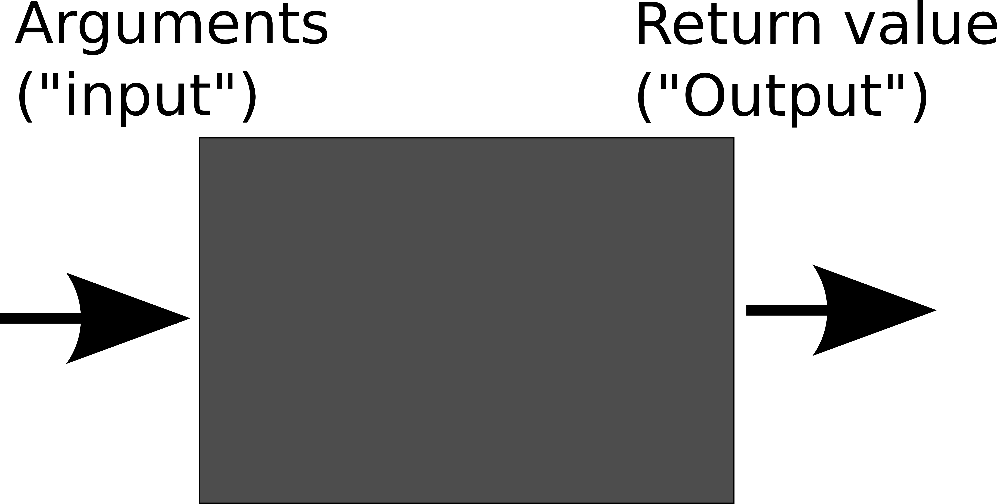

# Second Chapter: Advanced Python

##Functions
Previously, if we wanted to carry out actions twice or (even!) three times in a row, we would loops to do that. Similarly, we used if-statements to to select which parts of the code to execute in what cases.
However, we might want to reuse some functionality in different parts of the code, or provide similar sections of code. In Mathematics, you should have come across functions. In programming languages (and, because of that also in Python), we have functions as well. Instead of consisting of terms like a + b - c, we can just include **code** in functions. However, the basic principle is the same. Here's a little diagram to help you.



Basically, functions are a black box in which something happens. What happens? Well that depends on what we're doing. If we have a number, we could calculate the double of it. Normally, you would write it like:
```
f(x) = x * 2
```
Here, `f` is our *function name*, `x` our argument (input), and we return `x * 2`, i.e. double the value of the input.

In Python, we create functions by using the `def` keyword. Here is the above example in Python code:
```python
def getDouble(number):
  return number * 2
```
Ok. The structure for creating functions is `def <name of function>(argument1, argument2, argument3):`. In general, functions have the following properties:
* They can take a number of **arguments** specified by parentheses (in the example, `x` is an argument)
* They can **return** a value (but don't have to). The return type is typically the result of a series of different commands
* They sum up a **contained unit of code** that sums up a process

To put these aspects more into perspective, here is one more example program:

```python
'''
This program provides a simple menu to find out, if a name is in a list.
Also: These single quotes show comments over multiple lines, if you want to display more stuff. For example when explaining what your program does (which you should do!)
'''
names = ["Peter", "Paul", "Mary", "George", "Janos", "Chris", "Jaro"]

def isNameThere(name):
  for n in names:
    if n == name:
      return True
  return False

def getAction():
  print("1: See if name is in list")
  print("2: Quit")
  return int(input())

def decide(choice):
  if choice == 1:
    displayFind()
    decide(getAction())
  elif choice == 2:
    displayQuit()
  else:
    displayError()
    decide(getAction())

def displayFind():
  print("Please enter a string to see if it is in our list.")
  n = raw_input()
  '''we actually use a variant of input here that ALWAYS takes in strings, no matter what happens. We don't want Python to mess around with our input, do we? '''
  if isNameThere(n):
    print("It is indeed in our list!")
  else:
    print "Sorry, not known to me."

def displayError():
  print("Sorry, did not quite get that.")

def displayQuit():
  print("Goodbye!")

decide(getAction())
'''this is the place where we actually call our custom functions! These function calls are just like the system-provided functions print(), int(), input(), raw_input()...'''

```
A couple of things here:
1. Notice how the functions each show a single thought? This is crucial. Even if you only call your function a few times (or even once), it makes sense to keep functions **VERY** short (and by that we mean six lines or less, if possible). Oftentimes, what programmers do, they end up writing code and writing code and suddenly, they have a huge program with lots of duplicate code. On another note: Once they see their code later, they won't remember what they wrote because the code is so messy and complicated. In Computer Science slang, this is called *spaghetti code* or we say code has a *smell*.
2. There are a couple of things in the above code that don't quite make sense. Can you spot these? How might you design a better program? Note: Here, it's not about who is right or wrong, but it is more about discussing what good code is about. So no final solution is provided.

However, there are a few things to consider:
* Keep your code styling consistent (Use the same structure for calling functions over and over)
* Make use of in-built functions: There are more functions in Python than we could ever teach you. For example, in this program, it would be useful to know if python had more functions on lists. Google up on `finding out if element is in list python` (really easy? It is. But you still have to do the extra step!).
* Choose good names for variables and functions. For a more detailed description, look in Chapter 1.

##Exercises on functions

##Scope

## Object-oriented programming

As we have seen in previous sections, Python allows us to store data (in variables) and also manipulate data (using functions). What we usually notice (especially when writing larger programs) is that some of our functions "go together" with some of the variables. For example, when making games, we often have code like the following:
```python
spaceship_position = (30, 270)
spaceship_health = 100

def move_spaceship(delta):
    spaceship_x, spaceship_y = spaceship_position
    delta_x, delta_y = delta

    spaceship_x += delta_x
    spaceship_y += delta_y

    spaceship_position = (spaceship_x, spaceship_y)

def damage_spaceship(damage):
    spaceship_health -= damage

if __name__ == '__main__':
    move_spaceship(10, -30)
    damage_spaceship(100)
```
In this code, the variables `spaceship_position` and `spaceship_health` are changed by the functions `move_spaceship` and `return_spaceship_to_base`, so they "go together". This is okay when we have only one spaceship, but it becomes hard to manage when we want to add additional ships.

Imagine if we had two spaceships. We would have variables for the position and health of each of them and we'd have to modify the functions `move_spaceship` and `damage_spaceship` so they change the appropriate variable. But then what if we now want three spaceships? We'd have to change everything again. It quickly becomes impractical.

To solve this problem, we introduce two related ideas: objects and classes.

### What is an object?

Objects are a way of grouping related information (variables) and behaviour (functions) together. A spaceship, to continue with our previous example, can be thought of as an object:

 * it has a set of **attributes** – `position`, `health` – which describe its state
 * it has a set of **methods** – `move`, `take_damage` – which describe what it can do

It is important to note that both attributes and methods *belong* to the object. We could have many different spaceship objects and each of them would have their own `position` and `health`, as well as `move` or `take_damage` functions.

It's easier to understand the concept of an object when you actually see one being used in practice, so that is what we are going to do, but we need to introduce one additional concept before that: classes.

### What is a class?

Classes are blueprints for creating objects, or, if you wish, the recipe you use to create a new object. They describe what attributes and methods the objects you want to create will have. For example, we could have a `Spaceship` class, which we can define as follows:
```python
class Spaceship():
    name = None
    position = None
    health = None

    def __init__(self, name, position, health):
        self.name = name
        self.position = position
        self.health = health

    def move(self, delta):
        spaceship_x, spaceship_y = self.position
        delta_x, delta_y = delta

        spaceship_x += delta_x
        spaceship_y += delta_y

        self.position = (spaceship_x, spaceship_y)

    def take_damage(self, damage):
        self.health -= damage
```

There are quite a few new things to digest in this example, so let's take them one by one:

`class Spaceship()` – the `class` keyword here tells Python we are declaring a new class called `Spaceship`. Convention dictates that all class names start with an upper-case letter. Later, we will explain what the empty brackets after the name of the class mean.

`name`, `position` and `health` are attributes that all objects of class `Spaceship` will have.

`def __init__(self, name, position, health)` is a special kind of function called a **constructor**. Constructors belong to the class and are used to *instantiate* (create) new objects. Notice the special name. We will see how to use constructors shortly.

Also notice the special name `self`, which is the first argument of every method – Python passes it automatically, you don't have to do it yourself – and is also used to access attributes. `self` is used to reference attributes and methods belonging to the "current object", as opposed to those belonging to a different object.

### Instantiating objects

To create new objects, we must call the constructor of the class of object we want. For example, to create an object of the `Spaceship` class, we would do something like the following:
```python
s = Spaceship("USS Enterprise", (30, 220), 100)
```
This creates a new object of the `Spaceship` class and assigns it to the variable `s`. Here's a log of us interacting with the `s` object in the Python interpreter:
```python
>>> print s.name, s.position, s.health
USS Enterprise (30, 220) 100

>>> s.move((-10, -120))
>>> print s.position
(20, 100)  

>>> s.take_damage(80)
>>> print s.health
20
```

### Why is using objects better?

Not all programming languages have objects (for example, C doesn't) and any program that can written in an object-oriented language can also be written in a programming language that doesn't have objects, so why do we bother with them at all?

The reason is quite simple: as programs become larger and more complex, reasoning about them becomes harder. Breaking the program up into classes/objects allows us to hide away a lot of complexity and lets us concentrate on the big picture instead.

For example, say we have a class `List`. If we want to use the list, we don't need to actually know how it works internally. Instead, we only need to know the names of its methods:

```python
l = List()
l.append(45)
l.append(34)
l.extend([12, 20])
l.sort()
```

You don't need to know how `append`, `extend` and `sort` work internally or think about it in any way, which makes it much easier to reason about the logic of your program.

### Inheritance

### Easy exercises

### Challenging exercises

##Modules
