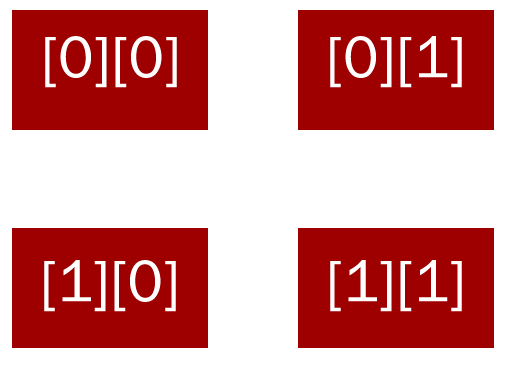

# Third Chapter: Programming games in PyGame

##Space invaders!
Now, let's start with proper game development, shall we? Let's start with one of the greatest games ever invented: SPACE INVADERS!
In practice, we have the following rules:
1) The player can move from left to right
2) Aliens move from right to left as well but not as often as the player
3) The player can shoot from time to time to take out the aliens and score points
4) The aliens shoot randomly and may harm the player (who has three lives)
5) The game ends if either no aliens are present any more or the player doesn't have any lives
6) If you're lucky, a different kind of alien can appear, moving fast but earning you loads of points

##So how do we start?
In this tutorial, I will only provide you with so-called *pseudocode*, that is code that looks almost like full-on code, but you have to do all the coding yourself. We have done all the thinking for you.

Let me first explain a bit how PyGame works.
In PyGame, we use something called **sprites** and a **display**. We draw sprites on the display (our screen).
Let's start with some example code:
```python
#from http://www.pygame.org/docs/tut/intro/intro.html, yes I know shamelessly copied
import sys, pygame

pygame.init()
size = width, height = 320, 240
speed = [2, 2]
black = 0, 0, 0
screen = pygame.display.set_mode(size)
ball = pygame.image.load("ball.bmp")
ballrect = ball.get_rect()
while 1:
  for event in pygame.event.get():
    if event.type == pygame.QUIT:
      sys.exit()
  ballrect = ballrect.move(speed)
  if ballrect.left < 0 or ballrect.right > width:
    speed[0] = -speed[0]
  if ballrect.top < 0 or ballrect.bottom > height:
    speed[1] = -speed[1]

  screen.fill(black)
  screen.blit(ball, ballrect)
  pygame.display.flip()
```
A couple of things here. You might have noticed that there is a `pygame` object which we modify, when we load images etc. Also notice the big `while`-loop, that goes forever (seemingly). So how does pygame draw stuff? Look at the last three lines: We first fill the screen black, then we draw the ball (`blit` is a very weird function, just be fine with passing the image and its rectangle and position to it). Finally, the `flip()` method: This finally accepts all changes and presents them to the viewer.

If we did not have the flip function, we would be unable to see our changes. Since it is very expensive to always draw stuff on the screen, it is better to have a lot of changes and then call `flip()` only once to set them free.

##Our first class for space invaders

We start with a **Entity** class, that is responsible for one, well, entity (so aliens, player...).
It has the following attributes:
```python
x, y, #the entities position as coordinates
dx, dy, #the change in coordinates in one update
image, #the image of the entity
width, height, #width and height of the entity
rect, #just an instance variable for the rect of the image, because we need that quite often
posBoundaryLeft, posBoundaryRight, #left and right boundaries in which the entity is restricted to move in


consider, #whether we actually draw the entity or not
gameWidth, gameHeight #for orientation the game's width and height.
```
The following is the constructor for class `Entity`:
```python
def __init__(self, x, y, dx, dy, image, gameWidth, gameHeight):
b        super(Entity, self).__init__()
    self.x = x
    self.y = y
    self.dx = dx
    self.dy = dy
    self.image = pygame.image.load(image)
    self.width = self.image.get_width()
    self.height= self.image.get_height()
    self.rect = self.image.get_rect()
    self.rect.x = self.x
    self.rect.y = self.y
    self.posBoundaryLeft = 20 + self.width/2
    self.posBoundaryRight= gameWidth - (20 + self.width/2)
    self.consider = True
    self.gameWidth = gameWidth
    self.gameHeight = gameHeight
```
Ok, so far so good, don't leave me just yet! As you can see, posBoundaryLeft and posBoundaryRight are by default set to be 20 pixels from the edges of the screen (plus half of the Entity's width). Please do go to the PyGame example and rewrite it using the Entity class. There, we will now add more methods:
```python
def update(self):
  '''this is just a function to both move the entity, check for its boundaries and to set self.rect.center = (self.x, self.y), in other words to adjust the rect to the entity's position'''

def intersects(self, entity):
  return self.rect.colliderect(Rect of another entity)
  '''this is a function that is built-in by default, but not so elegantly. This checks if the rect of one entity collides with another'''

def move(self):
  #adds dx to the variable x of the object and dy to y

def checkBoundaries(self):
  if self.x < self.posBoundaryLeft:
    self.x = self.posBoundaryLeft
    self.dx = - self.dx
  '''checks if the position is too far left: Is x smaller than posBoundaryLeft? If so, set the position of the object to the boundary and revert the direction in x-dimension (dx), similarly for the right side!'''

def isInScreen(self):
  return True if y > 0 and x > 0 and y < gameheight and x < gamewidth
  #return true if it is in screen (within game dimensions)

'''almost the same like the intersects function above, just checks if both entities are considered or not'''
def isHit(self, entity):
        return self.consider and entity.consider and self.intersects(entity)

def draw(self, screen):
  if to consider the object and it is inscreen then
    call screen.blit on the objects image and its rect
```
###Exercise time!
With this new class, start writing a small game in which we have two balls. For this, use the example code above and start shaping it with our fresh Entity class. If the two balls should collide, print "Oh no!" on the screen!

##Well, that's nice and fine, but I want a game!
Don't worry just for now! Let's add ANOTHER class, just for the sake of it to **inherit** from our Entity class, let's call it AliveEntity. Since we have both entities that need scores and those which don't, we need two separate classes for them. Although we essentially don't add much more to it, we still need different classes. Here is the constructor of `AliveEntity`:
```python
class AliveEntity(Entity):
    def __init__(self, score, x, y, dx, dy, image, lives, gameWidth, gameHeight):
        super(AliveEntity, self).__init__(x, y, dx, dy, image, gameWidth, gameHeight)
        self.score = score
        self.lives = lives
```
If you know say "wow that is weird", just bare with me one more moment. Because now, we can **overwrite** the `update()` method from the `Entity` class:

Since for aliens, we don't want them to move around too often, we need to leave out the moving and instead create another method responsible for updating WITH moving. There is really no way around it than to copy all the code for updating an entity from the Entity class (what a shame).
Nevertheless, we also add a check if the number of lives is smaller than zero. If so, we do not consider the entity.
 However, we add another method for updating the AliveEntity AND moving it. Lastly, we add an option to remove a life (this might seem superfluous, but it helps us focus on the more important bits).

 Here's the rest of the pseudocode for AliveEntity:

 ```
 def update(self):
   check boundaries
   set the rectangle to the position
   if it is not in screen or if it has less than zero lives,
    do not consider the entity

def updateWithMove(self):
    update
    move

def removeLife(self):
    subtract 1 from lives
 ```
 ...that's it! Now, up for an exercise:

 ##Exercise!
 Use the AliveEntity class to create a multidimensional array. In a new file called `spaceinvaders.py`, import pygame and the new class by
 ```python
 from AliveEntity import AliveEntity
 ```
 and then create said array. In each element, there should be an entity. Just download some image from the internet to represent the entities. The goal of this exercise is to successfully render the entities on screen how they show up in your array. See below picture for help.

 
 The "lowest" element should be on the top-left, then right to it, [0][1]... etc. In order to do this, create two for-loops: The first one just goes through all the "rows", the second one through all the elements in that row.

 Make sure that you position the elements correctly, with enough spacing. For drawing, just loop through the entire array, each time calling `draw()` on each element.

##Keyboard input in Python and the Player class

Now, we create the class representing the player. Why a special class for player, you ask? Well, the player has some special responsibilities:
* If the user presses the left key, the player moves left
* If the user presses the right key, the player moves right
* Each time the player updates, it has to reset its speed to 0, if no button is pressed

Here we go! Player inherits from AliveEntity. Here is the class in Pseudocode:

```python
import pygame
from AliveEntity import AliveEntity

class Player(AliveEntity):
    def __init__(self, score, lives, gameWidth, gameHeight):
        super(Player, self).__init__(score, gameWidth/2, 400, 0, 0, "img/player.png", lives, gameWidth, gameHeight)

    def checkKeyboardInput(self, pressed_keys):
        self.checkGoLeft(pressed_keys)
        self.checkGoRight(pressed_keys)

    def checkGoLeft(self, pressed_keys):
        if pressed_keys[pygame.K_a] or pressed_keys[pygame.K_LEFT]:
            set dx to -1

    def checkGoRight(self, pressed_keys):
        if pressed_keys[pygame.K_d] or pressed_keys[pygame.K_RIGHT]:
            set dx to one

    def update(self):
        call the update function of the super class
        move the player
        set dx to zero
```


 ##Continuing our game: The "Game" class
 Now, let's create the main class of our Game, logically called Game. In here, all the basic functionality is carried out:
 * We draw all of our entities
 * We compute input
 * We see if the game is over
 * We carry out all the other game rules

 So, for this, create a new file called (you wouldn't have guessed) Game.py

At the top, we import the following modules:
```python
import pygame
import random
from AliveEntity import AliveEntity
```
Here's the pseudocode:
```python

class Game():
    def __init__(self, startScore, aliens, player, width, height, size):
        self.score = startScore
        self.ticks = 0
        self.player= player
        self.aliens= aliens
        self.running = True
        self.aliensExist = True
        self.screen = pygame.display.set_mode(size)
        self.width = width
        self.height = height

    def addScore(self, toAdd):
        add the amount there to the score

    def isLucky(self, chance):
        see if random.random() is greater than change, If you want to find out what random.random() does, google it!

    def checkGameStop(self, event):
        if event.type == pygame.QUIT:
            self.running = False
        There is really no explaining for this: We come to this later

    def computeInput(self):
        for event in pygame.event.get():
            self.checkGameStop(event)
        same here

    def drawAlien(self, alien):
        if self.ticks % 200 == 0:
          update the alien and move it
        else:
            just update it
        in any case, draw the alien

    def drawAliens(self):
        self.aliensExist = False
        loop through all the aliens, just as described in the exercise before.
        for each alien, decide:
          If alien is not None:
            self.aliensExist = True
            self.drawAlien(alien)

    def update(self):
        self.player.draw(self.screen)
        self.drawAliens()
        self.computeInput()
        self.player.update()
        self.ticks += 1
        if self.isGameOver():
            self.running = False

    def isGameOver(self):
        return true if the player doesnt have any more lives or if there are no more aliens

    def isRunning(self):
        return self.running
```
Please complete the pseudocode accordingly.
##Exercise
In order to use this game, we expand our spaceinvaders.py a bit.

```python
import pygame
import sys
from AliveEntity import AliveEntity
from Player import Player
from Game import Game

pygame.init()

size = width, height = 448, 512
white = 255, 255, 255

def spawnNewAlien(xpos, ypos):
    startPosx = width/2 -1400 + 30 * xpos
    startPosy = height/2 - 130 + 30 * ypos
    imageName = "img/sprite" + str(ypos + 1) + ".png"
    score = 5 * (6 - ypos)
    newAlien = AliveEntity(score, startPosx, startPosy, 4, 0, imageName, 1, width, height)
    newAlien.posBoundaryLeft = 50 + 30 * xpos
    newAlien.posBoundaryRight= width -50 - 30 * (10 - xpos)
    return newAlien

def createAliens(cols, rows):
    here the code for creating the array of aliens. For every alien, it should create the alien and add it to the array. We do this to pass the array to our Game class later. The code below should look similar to the one above, except for one point:
    aliens = []
    for i in range(cols):
        row = []
        for j in range(rows):
            newAlien = spawnNewAlien(i, j)
            row.append(newAlien)
        aliens.append(row)
    return aliens

def printEndMessage(message):
    text = game.display.font.render(message, 1, white)
    textRect = text.get_rect()
    textRect.x = width/2
    textRect.y = height/2
    game.screen.blit(text, textRect)
    pygame.display.flip()

def runGame(game, clock):
    while game is running,
      call game.update()
      do pygame.display.flip()
      clock.tick(300)

clock = pygame.time.Clock()
aliens = createAliens(11, 5) #we create 11x5 = 55 aliens
player = Player(-100, 3, width, height) #the player is a special class.
game = Game(0, aliens, player, width, height, size)

runGame(game, clock)

print("END")
while True:
    for event in pygame.event.get():
        if event.type == pygame.QUIT:
            break
    pressed_keys = pygame.key.get_pressed()
    if pressed_keys[pygame.K_SPACE]:
        break
    if no aliens exist,
        printEndMessage("YOU WON!")
    else:
        printEndMessage("YOU LOST.")
    clock.tick(300)
pygame.quit()
```
You see the part after `print("END")`? This part just displays a nice end message to the user. Feel free to customize everything.

##Modify our Game class to work with the player
Since we now have the Player ready, we can modify our Game class to pass on keyboard presses and to control the player ...would you think! But in fact, we don't have to because we have overridden the `update()` function, which automatically deals with everything..

... so no need to do anything

##Time for some more randomness
If you want to look up in this document, you will find out that every once in a while, we want an alien to come up in our game and to sweep right at a high speed. For this, we add things to our Game class:
In our constructor, we add
```python
self.specialAlien = AliveEntity(0, 0, 0, 0, 0, "img/shot.png", 0, width, height) #this is just a dummy assignment..
self.specialAlien.consider = False
```
More down in the code, let's add one more method:
```python
def spawnSpecialAlien(self):
  print("SPECIALALIEN")
  self.specialAlien = AliveEntity(100, 100, 90, 2, 0, "img/sprite8.png", 1, self.width, self.height)
  self.specialAlien.posBoundaryRight = self.width + 40
```
In this method, we just set the instance variable to a new entity with the following properties:
```
score: 100
position x: 100
position y: 90
dx: 2
dy: 0
image: "img/sprite8.png"
lives: 1
width: width of game
height: height of game
```
Easy! In addition to that, if it moves further right than `width + 40`, will it stop? Yes, according to how we specified in our AliveEntity class, as soon as it goes out of bounds.

As you can see, this is quite basic here. This is because we have done all the hard work before, now we just need to fill in the blanks.

Now, we can create a function in our Game class that combines both functions:
```python
def dealWithSpecialAlien():
  self.specialAlien.updateWithMove()
  self.specialAlien.draw()
```
In our `update()` function, we have to call this function after we draw the player.

One last thing: So far, we don't add the special alien at all. To adjust this, we add more code at the end of our `update()` function to call our `spawnSpecialAlien()` function if we are lucky. Let's do this, add:
```python
if(self.isLucky(0.99999)):
    self.spawnSpecialAlien()
```
Done!! Feel free to set the value in parentheses to a lower value, if you want the special alien to spawn more often.

##Now, let's add some bang to our application
###Shooting player
Let's start with the following rules:
* The player can shoot shots which can hit aliens and destroy them
* The aliens randomly shoot at the player and can reduce the amount of lives the player has
For this, we don't need a whole class to encapsulate a shot.
It is enough that we just use our existing `Entity` class. Convenient! In our player class, let's add a couple of functions.

1. We have to account for shooting quickly: We only want the player to be able to shoot say every 200 ticks, so we have to keep track of the previous shot. We do so, by adding a simple instance variable in the Player class. To our constructor, add
```python
self.last_shot = 0
```
2. We need a separate function to check for if the player should shoot because we need to pass the current ticks from the game. This gives us the function
```
def checkShoot(self, pressed_keys, ticks):
  shot = None
  if pressed_keys[pygame.K_SPACE] and ticks > self.last_shot + 200
    create shot
  return shot
```
For now, just do `print("Shooting!")` to check if your code is working correctly.
3. Add the code for creating a shot. This means we create two functions: One for all of the business around shooting and one for actually creating the shot. This leaves us with two functions, `shoot()` and `makeShot()`.
For shoot, the function should look like this (add in the blanks!)
```python
def shoot(self, ticks):
  shot = self.makeShot()
  set last shot to the ticks specified
  return shot
```
For actually shooting, we have to specify what we want our Shot to actually look like. We want it to have the following properties:
```
x position: self.x
y position: self.y
dx: 0
dy: -1.25
image: "img/shot.png"
width: self.gameWidth
height: self.gameHeight
```
Now, we can specify the `makeShot()` function. If you can figure it out yourself, please don't look at the code below!
```python
def makeShot(self):
  shot = Entity(self.x, self.y, 0, -1.25, "img/shot.png", self.gameWidth, self.gameHeight)
  return shot
```
Back in our function `checkShoot()`, we can now call the `shoot()` function with the correct arguments.

ONE MORE THING THOUGH!
In our `Game` class, let's add code to (maybe) shoot in our `computeInput()` function:
At the bottom, add
```python
shot = self.player.checkShoot(pressed_keys, self.ticks)
```
... else it doesn't work!

###Shooting aliens (oh noooooo!)
```
##Todo: ShotEngine (Shooting aliens), Display,
